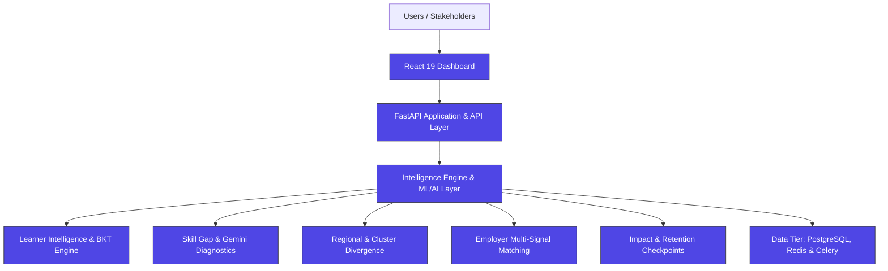
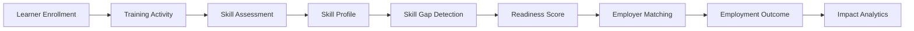

# KaushalNexus

### Employment & Skilling Intelligence Platform

Longitudinal skilling outcomes and impact measurement platform for India's skilling ecosystem.

[](https://react.dev)
[](https://vitejs.dev)
[](https://tailwindcss.com)
[](https://reactrouter.com)
[](https://recharts.org)
[](https://lucide.dev)
[]()
[](LICENSE)

[Repository](https://github.com/calligraphyguruji/Kaushal-Nexus.git) · [The Problem](#-the-problem) · [Architecture](#-platform-architecture) · [Roadmap](#-roadmap)

---

## 📌 Overview

**KaushalNexus** is an employment and skilling intelligence platform designed to build a longitudinal system to track employment outcomes, skill gaps, and the real-world impact of skilling initiatives.

Rather than treating training enrolment and completion as end goals, KaushalNexus is designed around a single question: **did skilling actually lead to employment, and where does the system need to intervene?**

It connects every stage of the skilling lifecycle into one intelligence pipeline:

```
Learners → Skills → Training Progress → Skill Gaps → Regional Intelligence → Employers → Employment Outcomes
```

> This repository contains the complete **full-stack intelligence platform** — featuring a modern React 19 frontend dashboard, high-performance FastAPI backend, automated AI/ML pipelines (Google Gemini API & scikit-learn models), and PostgreSQL/Redis data architecture. See [Roadmap](#-roadmap) for detailed feature coverage and future enhancements.

---

## 🧩 The Problem

Most skilling and training programs — government-run or private — are evaluated using **enrolment and completion metrics**. This creates a critical measurement gap that KaushalNexus is designed to address:

- Completion of a training program does not guarantee that a learner becomes employed or employable.
- Skill gaps between what learners are trained in and what employers actually demand are hard to detect until it's too late to intervene.
- Employment outcomes vary significantly by region, but this variance is rarely tracked systematically.
- Employer skill demand and training program design operate largely in isolation from one another.
- Policymakers and training institutions lack longitudinal, evidence-based visibility into whether skilling investments are translating into jobs.

Without this visibility, skilling programs are optimized for throughput (people trained) rather than outcomes (people employed).

---

## 💡 Our Solution

KaushalNexus is designed as a continuous intelligence layer over the skilling ecosystem, not a standalone tracking tool. The platform's design centers on:

- **Longitudinal learner tracking** — following a learner from enrolment through training, certification, and (eventually) employment, rather than a single-point-in-time snapshot.
- **Verified skills over self-reported skills** — distinguishing between claimed skills and assessed/verified competencies.
- **Skill-gap intelligence** — surfacing the delta between what the workforce is being trained in and what employers are actually hiring for.
- **Employment readiness scoring** — a composite view of how job-ready a learner is, not just how much training they've completed.
- **Employer matching** — aligning learner skill profiles with real employer demand signals.
- **Regional intelligence** — identifying which districts are converting training into employment, and which need intervention.
- **Intervention recommendations** — pointing training institutions and policymakers toward specific, actionable gaps.
- **Outcome measurement** — closing the loop by measuring whether interventions actually improve employment conversion over time.

---

## ✨ Key Features

| Feature | Description |
|---|---|
| 🧑‍🎓 **Learner 360°** | A unified profile per learner spanning identity, training progress, verified skills, skill gaps, readiness score, and employment status. |
| 📊 **Skill Gap Intelligence** | Visualizes demand vs. supply mismatches and flags high-priority, emerging skill shortages. |
| 🗺️ **Regional Intelligence** | District-level view of employment conversion, skill-gap severity, and employer concentration. |
| 🤝 **Employer Matching** | Multi-signal matching of learners to job opportunities based on skill alignment, location fit, wage expectations, and employer demand. |
| ✅ **Employment Readiness** | A readiness score summarizing how prepared a learner is for the job market. |
| 📈 **Training Progress** | Tracks the learner journey from enrolment → training → certification → employment. |
| 🤖 **AI Recommendation Panels** | Surfaces AI-powered gap diagnostics, root-cause rationale, and personalized phased learning roadmaps generated via Google Gemini. |
| 🎯 **Impact Measurement** | Program- and region-level dashboards summarizing skilling impact over time. |

---

## 🏗️ Platform Architecture



**Legend:** 🟣 Indigo = Fully implemented full-stack architecture (React Dashboard, FastAPI REST API, Intelligence Engine, ML/AI Inference Layer, and PostgreSQL/Redis/Celery Data Tier).

---

## 🔄 Data / Intelligence Flow



This represents the end-to-end data flow implemented across the platform — connecting registration, BKT-based competency assessment, AI skill-gap diagnosis, composite readiness scoring, multi-signal employer matching, and longitudinal retention tracking.

---

## 🧭 Modules

| Module | Purpose | Key Signals |
|---|---|---|
| **Overview / Impact Dashboard** | High-level program and platform-wide impact snapshot | Learners tracked, employment rate, active interventions |
| **Learner Intelligence** | Learner 360° profile and individual journey tracking | Readiness score, verified skills, skill gaps, employment status |
| **Skill Gap** | Demand vs. supply intelligence across skills | High-priority skills, emerging shortages, training alignment |
| **Regional Intelligence** | District-level employment and skilling intelligence | Employment %, high-gap districts, employer concentration |
| **Employer Matching** | Learner–employer alignment and job matching insights | Skill alignment, location fit, employer demand signals |
| **Settings** | Platform and account configuration | User/role preferences *(implementation status: in progress)* |

---

## 👤 Learner 360°

The **Learner Intelligence** module is the platform's core individual-level view. For each learner it surfaces:

- **Learner profile & ID** — identity, training program, and location
- **Readiness score** — a composite measure of employment readiness
- **Verified skills** — skills confirmed through assessment rather than self-reported
- **Skill gaps** — the delta between a learner's current skills and target-role requirements
- **Training progress** — completion status across enrolled programs
- **Learner journey** — a visual timeline from enrollment → training → certification → employment
- **AI recommendations** — suggested next steps or interventions for the learner

This view is designed to move institutions away from asking "did they complete the course?" toward "are they actually ready for a job, and if not, what's missing?"

---

## 🗺️ Regional Intelligence

Skilling outcomes vary significantly by geography, and the **Regional Intelligence** module is built to make that variance visible at the district level. It's designed to help identify:

- Districts with **low employment conversion** despite high training volume
- Districts with **high skill gaps** relative to local employer demand
- **Regional demand patterns** — which skills are most sought after in which districts
- **Priority intervention areas** — where limited resources should be directed first
- **Employer concentration** — where employer presence is clustered vs. sparse

This is intended to support policymakers and training institutions in allocating resources based on measured outcomes rather than uniform, region-agnostic planning.

---

## 🤝 Employer Matching

The **Employer Matching** module pairs candidate profiles with corporate hiring mandates using a **multi-signal matching algorithm** and ML semantic embedding layer:

- **Semantic Skill Vector Distance** — TF-IDF and Soft-Jaccard similarity scoring between candidate competencies and job requirements
- **Location Fit & Geo-Proximity** — district-level distance evaluation
- **Wage & Experience Alignment** — candidate wage expectation vs. employer compensation band
- **Employment Readiness Thresholds** — composite readiness score validating role preparedness
- **Automated Batch Dispatch** — ranked dispatching of candidate cohorts with immutable audit logging

---

## 🤖 AI / Intelligence Layer & Google Gemini API Integration

KaushalNexus integrates **Google Gemini AI** (via `GEMINI_API_KEY` on the FastAPI backend) to deliver **AI-Powered Learner Intelligence & Skill Gap Diagnostics**.

- **Google Gemini REST API**: Connects to `gemini-3.7-flash` (or `gemini-2.5-flash` / configurable) using native structured JSON mode (`response_mime_type: "application/json"`).
- **Diagnostic Gap Identification**: Compares verified candidate competencies against live employer demand to isolate high-priority deficits.
- **Personalized Phased Roadmaps**: Generates 3-phase modular learning trajectories with specific lab exercises, durations, and benchmark outcomes.
- **Explainable Rationale**: Articulates why each skill gap matters for enterprise hiring mandates.
- **Targeted Lab Projects**: Recommends practical hands-on implementations to build recruiter-ready portfolios.
- **Job Readiness Milestones**: Estimates time-to-readiness and aligns candidates with suitable employment roles.
- **Privacy & Grounding**: Input data is sanitized to strip PII. AI outputs are strictly grounded on actual candidate records without fabricating database statistics.

| Feature | Provider / Model | Status | Endpoint |
|---|---|---|---|
| **AI Skill Gap & Roadmap** | Google Gemini (`gemini-3.7-flash` configurable) | ✅ Active | `POST /api/v1/ai/skill-gap-analysis` |
| **Semantic Vector Matching** | TF-IDF & Cosine Distance Engine | ✅ Active | `POST /api/v1/ml/skill-similarity` |
| **Starting Compensation Predictor** | Ridge Regression Wage Estimator | ✅ Active | `POST /api/v1/ml/predict-wage` |

---

## 🛠️ Tech Stack

### Frontend

| Layer | Technology | Version |
|---|---|---|
| Frontend Framework | React | ^19.2.8 |
| Build Tool | Vite | ^8.2.2 |
| Styling | Tailwind CSS (via `@tailwindcss/vite`) + Design System | ^4.3.3 |
| Routing | React Router DOM | ^7.18.2 |
| Data Visualization | Recharts | ^3.10.1 |
| Icons | Lucide React | ^1.34.0 |
| HTTP Client | Axios (with JWT interceptors & token rotation) | ^1.20.0 |

### Backend & AI Service

| Layer | Technology | Version |
|---|---|---|
| Backend Framework | FastAPI | ^0.115.0 |
| ASGI Server | Uvicorn | ^0.32.0 |
| AI Service | **Google Gemini API** (`gemini-3.7-flash` / `gemini-2.5-flash`) | Live + Deterministic fallback |
| Validation | Pydantic v2 & Pydantic Settings | ^2.9.0 |
| Database | PostgreSQL (asyncpg connection pool) + SQLAlchemy 2.0 | ^2.0.35 |
| Cache & Task Broker | Redis + Celery | ^5.2.0 |


---

## 📁 Project Structure

```
KaushalNexus/
├── frontend/
│   ├── src/
│   │   ├── __tests__/
│   │   ├── api/
│   │   ├── assets/
│   │   ├── auth/
│   │   ├── components/
│   │   ├── context/
│   │   ├── data/
│   │   ├── hooks/
│   │   ├── layouts/
│   │   ├── pages/
│   │   ├── styles/
│   │   ├── utils/
│   │   ├── App.jsx
│   │   ├── App.css
│   │   ├── index.css
│   │   └── main.jsx
│   ├── public/
│   ├── .env.example
│   ├── eslint.config.js
│   ├── index.html
│   ├── package.json
│   ├── package-lock.json
│   ├── vercel.json
│   └── vite.config.js
├── backend/
│   ├── alembic/
│   ├── scripts/
│   ├── src/
│   │   ├── api/
│   │   ├── core/
│   │   ├── middleware/
│   │   ├── ml/
│   │   ├── models/
│   │   ├── schemas/
│   │   ├── services/
│   │   ├── workers/
│   │   ├── main.py
│   │   └── seed.py
│   ├── tests/
│   ├── .env.example
│   ├── alembic.ini
│   ├── docker-compose.yml
│   ├── Dockerfile
│   ├── entrypoint.sh
│   ├── pytest.ini
│   ├── README.md
│   └── requirements.txt
├── .gitignore
├── .env.example
└── README.md
```

> The frontend communicates directly with the FastAPI backend via Axios API clients with JWT authentication and refresh token rotation. Seeded deterministic datasets are also provided in `frontend/src/data/` for standalone client-side preview and testing.

---

## 📱 Responsive Design

The dashboard is designed to work across:

- 🖥️ **Desktop** — full sidebar + multi-column data views
- 📟 **Tablet** — adaptive grid layouts
- 📱 **Mobile** — collapsible sidebar via a mobile navigation drawer
- 📊 Responsive **cards, grids, and tables** throughout every module

---

## 🎨 Design System

| Color | Role |
|---|---|
| 🟦 **Indigo / Navy** | Primary — intelligence, structure, core UI |
| 🟧 **Amber** | Attention / recommendation signals |
| 🟩 **Emerald** | Positive / completed states |
| 🟥 **Rose** | High-risk / critical alerts |
| ⬜ **Slate** | Neutral UI, backgrounds, and text |

Design tokens live in `src/styles/design-system.css`, layered with Tailwind CSS utility classes throughout the component tree.

---

## 🚀 Installation & Running

### 1. Backend Setup (FastAPI + NPMAI AI Ecosystem)

```bash
cd backend

# 1. Create and activate virtual environment (Python 3.12+)
python3 -m venv .venv
source .venv/bin/activate

# 2. Install backend dependencies (including NPMAI)
pip install -r requirements.txt
# Or directly: pip install npmai

# 3. Configure environment variables
cp .env.example .env

# NPMAI Configuration in .env:
# NPMAI_MODEL=llama3.2   (options: llama3.2, mistral, gemma2, phi3, qwen2.5, deepseek-r1)
# NPMAI_TEMPERATURE=0.3
# NPMAI_AUTO_FALLBACK=true

# 4. Run tests
pytest tests

# 5. Start the FastAPI development server
uvicorn src.main:app --reload --port 8000
```

FastAPI Swagger Docs will be available at: `http://localhost:8000/docs`

### 2. Frontend Setup (React + Vite)

```bash
cd frontend

# Install dependencies (if not already installed)
npm install

# Start Vite dev server
npm run dev
```

The frontend dashboard will be available at: `http://localhost:5173/`

---

## 📜 Available Scripts

| Script | Command | Description |
|---|---|---|
| `npm run dev` | `vite` | Starts the Vite development server |
| `npm run build` | `vite build` | Creates a production build |
| `npm run preview` | `vite preview` | Serves the production build locally for preview |
| `npm run lint` | `eslint .` | Runs ESLint across the project |
| `pytest` | `pytest tests` | Executes all 212 automated backend unit & integration tests |

---

## 🗺️ Roadmap

**Implemented**
- [x] **Full-Stack Core Architecture**: React 19 + Vite frontend coupled with FastAPI Python 3.12 async backend
- [x] **Database & Migrations**: PostgreSQL with PostGIS extensions, SQLAlchemy 2.0 (Async) ORM & Alembic migrations
- [x] **Security, JWT & RBAC**: JWT access & refresh token rotation, bcrypt password hashing, and role-based access control (MSDE Officer, State Admin, Training Provider, Employer, Evaluator, System Admin)
- [x] **Google Gemini AI Integration**: Structured JSON gap diagnostics, root-cause rationale & 3-phase personalized learning roadmaps via Gemini API (`gemini-3.7-flash` / `gemini-2.5-flash`)
- [x] **Machine Learning Layer**: TF-IDF semantic skill embeddings, Soft-Jaccard similarity scoring, and Ridge regression starting wage estimator
- [x] **Bayesian Knowledge Tracing (BKT)**: Closed-loop adaptive competency assessment engine with item-level slip/guess modeling
- [x] **Multi-Signal Employer Matching**: Candidate-mandate scoring combining semantic skill vector distance, geo-proximity, wage alignment, and readiness thresholds
- [x] **Longitudinal Retention Tracking**: 3-month, 6-month, and 12-month post-placement milestone tracking and career trajectories
- [x] **External Verification Adapters**: Sandbox adapters for Aadhaar eKYC, EPFO payroll validation, and Skill India Digital (SID) records
- [x] **Background Worker Pipelines**: Celery task queue with Redis broker for asynchronous report generation, cohort tracking, and follow-ups
- [x] **Learner 360° & Intelligence UI**: Comprehensive dashboards with Recharts data visualization, design system tokens, and PDF/CSV dossier exporters
- [x] **Automated Test Suite**: 212 comprehensive backend unit, security, BKT, ML, and integration tests (`pytest` + `pytest-asyncio` + `httpx`)

**Planned**
- [ ] **Production Cloud Deployment**: Automated Kubernetes (EKS/GKE) cluster manifests with CI/CD deployment pipelines
- [ ] **Live Government Gateways**: Production API integration for EPFO, DigiLocker, and national portals (moving beyond sandbox adapters)
- [ ] **Real-Time Telemetry & Event Streaming**: Apache Kafka / AWS Kinesis pipelines for high-throughput live event ingestion
- [ ] **Native Mobile Application**: Cross-platform mobile app (React Native / Flutter) for field counselors and learners
- [ ] **Multilingual Support**: UI and assessment localization across 12+ Indian regional languages
- [ ] **Curriculum LLM Fine-Tuning**: Specialized fine-tuned models trained on National Occupational Standards (NOS) and regional vocational curricula
- [ ] **Live Job Board Connectors**: Webhook and feed connectors with major public employment exchanges and private job portals

---

## 🎯 Addressing Core Challenges — Platform Impact & Solutions

| Problem | KaushalNexus Response | Expected Impact |
|---|---|---|
| Enrolment/completion tracked, employment isn't | Learner 360° tracks the full journey through to employment status | Institutions can see beyond completion rates |
| Skill gaps hard to detect longitudinally | Dedicated Skill Gap module comparing demand vs. supply over time | Earlier detection of shortages, more targeted training |
| Regional employment differences hard to monitor | District-level Regional Intelligence dashboard | Resource allocation can target underperforming regions |
| Employer demand disconnected from training supply | Employer Matching module aligning skills with demand signals | Training programs can align curricula with real demand |
| No measurable evidence of skilling impact | Impact Dashboard aggregating outcomes at program/region level | Policymakers gain an evidence base for skilling investment |

---

## 📈 Expected Impact

KaushalNexus is designed to help:

- **Learners** — gain clearer visibility into their readiness and the specific skill gaps standing between them and employment.
- **Training institutions** — move from completion-based reporting to outcome-based evaluation of their programs.
- **Employers** — get a clearer signal of the skilled talent pipeline available in their region.
- **Policymakers** — access district-level evidence to prioritize skilling investment where it's needed most.
- **Skill-development programs** — identify which interventions actually improve employment conversion, rather than assuming completion equals success.

These outcomes are aspirational goals the platform **is designed to** support — they reflect the prototype's intent, not measured real-world results.

---

## 🔭 Future Scope

- Real-time employment outcome integration
- Government / NSDC-style data integration, where applicable
- Advanced ML-based employer matching
- Predictive skill demand forecasting
- District-level demand forecasting
- Intervention effectiveness measurement
- Multilingual support
- Role-based access control
- Analytics exports
- Longitudinal cohort analysis

---

## 🖼️ Screenshots

> Screenshots are not yet included in this repository.

| Module | Path |
|---|---|
| Overview | `docs/screenshots/overview.png` *(TODO)* |
| Learner Intelligence | `docs/screenshots/learner-intelligence.png` *(TODO)* |
| Skill Gap | `docs/screenshots/skill-gap.png` *(TODO)* |
| Regional Intelligence | `docs/screenshots/regional-intelligence.png` *(TODO)* |
| Employer Matching | `docs/screenshots/employer-matching.png` *(TODO)* |

---

## 👤 Author

- **Aman Mishra** ([@calligraphyguruji](https://github.com/calligraphyguruji))
---

## 📄 License

This project is open source and available under the **[MIT License](LICENSE)**.

```text
MIT License

Copyright (c) 2026 Aman Mishra

Permission is hereby granted, free of charge, to any person obtaining a copy
of this software and associated documentation files (the "Software"), to deal
in the Software without restriction, including without limitation the rights
to use, copy, modify, merge, publish, distribute, sublicense, and/or sell
copies of the Software, and to permit persons to whom the Software is
furnished to do so, subject to the following conditions:

The above copyright notice and this permission notice shall be included in all
copies or substantial portions of the Software.

THE SOFTWARE IS PROVIDED "AS IS", WITHOUT WARRANTY OF ANY KIND, EXPRESS OR
IMPLIED, INCLUDING BUT NOT LIMITED TO THE WARRANTIES OF MERCHANTABILITY,
FITNESS FOR A PARTICULAR PURPOSE AND NONINFRINGEMENT. IN NO EVENT SHALL THE
AUTHORS OR COPYRIGHT HOLDERS BE LIABLE FOR ANY CLAIM, DAMAGES OR OTHER
LIABILITY, WHETHER IN AN ACTION OF CONTRACT, TORT OR OTHERWISE, ARISING FROM,
OUT OF OR IN CONNECTION WITH THE SOFTWARE OR THE USE OR OTHER DEALINGS IN THE
SOFTWARE.
```

---

**KaushalNexus — Employment & Skilling Intelligence Platform**
