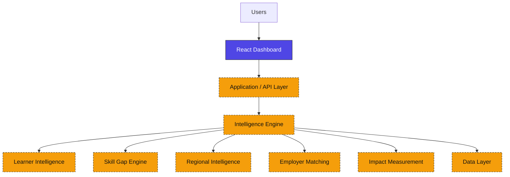
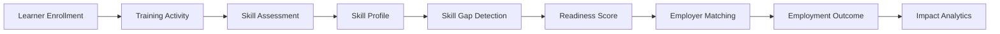

# KaushalNexus

### Employment & Skilling Intelligence Platform

Longitudinal skilling outcomes and impact measurement for India's skilling ecosystem — built for **Smart India Hackathon 2026, Problem Statement 135**.

[](https://react.dev)
[](https://vitejs.dev)
[](https://tailwindcss.com)
[](https://reactrouter.com)
[](https://recharts.org)
[](https://lucide.dev)
[]()
[]()

[Live Demo](#) · [Repository](#) · [Problem Statement](#-problem-statement) · [Roadmap](#-roadmap)

---

## 📌 Overview

**KaushalNexus** is a prototype employment and skilling intelligence platform built to address **SIH Problem Statement 135**: developing a longitudinal system to track employment outcomes, skill gaps, and the real-world impact of skilling initiatives.

Rather than treating training enrolment and completion as end goals, KaushalNexus is designed around a single question: **did skilling actually lead to employment, and where does the system need to intervene?**

It connects every stage of the skilling lifecycle into one intelligence pipeline:

```
Learners → Skills → Training Progress → Skill Gaps → Regional Intelligence → Employers → Employment Outcomes
```

> This repository currently contains the **frontend intelligence dashboard**. Backend services, live data pipelines, and AI/ML components are part of the planned architecture — see [AI / Intelligence Layer](#-ai--intelligence-layer) and [Roadmap](#-roadmap) for what's implemented versus planned.

---

## 🧩 Problem Statement

Most skilling and training programs — government-run or private — are evaluated using **enrolment and completion metrics**. This creates a measurement gap that Problem Statement 135 is designed to close:

- Completion of a training program does not guarantee that a learner becomes employed or employable.
- Skill gaps between what learners are trained in and what employers actually demand are hard to detect until it's too late to intervene.
- Employment outcomes vary significantly by region, but this variance is rarely tracked systematically.
- Employer skill demand and training program design operate largely in isolation from one another.
- Policymakers and training institutions lack longitudinal, evidence-based visibility into whether skilling investments are translating into jobs.

Without this visibility, skilling programs are optimized for throughput (people trained) rather than outcomes (people employed).

---

## 💡 Our Solution

KaushalNexus is designed as a continuous intelligence layer over the skilling ecosystem, not a standalone tracking tool. The platform's design centers on:

- **Longitudinal learner tracking** — following a learner from enrolment through training, certification, and (eventually) employment, rather than a single-point-in-time snapshot.
- **Verified skills over self-reported skills** — distinguishing between claimed skills and assessed/verified competencies.
- **Skill-gap intelligence** — surfacing the delta between what the workforce is being trained in and what employers are actually hiring for.
- **Employment readiness scoring** — a composite view of how job-ready a learner is, not just how much training they've completed.
- **Employer matching** — aligning learner skill profiles with real employer demand signals.
- **Regional intelligence** — identifying which districts are converting training into employment, and which need intervention.
- **Intervention recommendations** — pointing training institutions and policymakers toward specific, actionable gaps.
- **Outcome measurement** — closing the loop by measuring whether interventions actually improve employment conversion over time.

---

## ✨ Key Features

| Feature | Description |
|---|---|
| 🧑‍🎓 **Learner 360°** | A unified profile per learner spanning identity, training progress, verified skills, skill gaps, readiness score, and employment status. |
| 📊 **Skill Gap Intelligence** | Visualizes demand vs. supply mismatches and flags high-priority, emerging skill shortages. |
| 🗺️ **Regional Intelligence** | District-level view of employment conversion, skill-gap severity, and employer concentration. |
| 🤝 **Employer Matching** | Conceptual matching of learners to job opportunities based on skill alignment, location fit, and employer demand. |
| ✅ **Employment Readiness** | A readiness score summarizing how prepared a learner is for the job market. |
| 📈 **Training Progress** | Tracks the learner journey from enrolment → training → certification → employment. |
| 🤖 **AI Recommendation Panels** | Surfaces recommended interventions and next steps (UI implemented; recommendation logic is a planned capability — see below). |
| 🎯 **Impact Measurement** | Program- and region-level dashboards summarizing skilling impact over time. |

---

## 🏗️ Platform Architecture



**Legend:** 🟣 Indigo = currently implemented in this repository (React dashboard with static/mock data) · 🟠 Amber (dashed) = planned architecture — API layer, intelligence engine, and persistent data layer are not yet implemented.

---

## 🔄 Data / Intelligence Flow



This represents the intended end-to-end data flow the platform is designed around. In the current prototype, this flow is reflected in the UI/UX and mock data structures — the live pipeline (real-time skill assessment, readiness scoring, and outcome tracking) is part of the planned backend work.

---

## 🧭 Modules

| Module | Purpose | Key Signals |
|---|---|---|
| **Overview / Impact Dashboard** | High-level program and platform-wide impact snapshot | Learners tracked, employment rate, active interventions |
| **Learner Intelligence** | Learner 360° profile and individual journey tracking | Readiness score, verified skills, skill gaps, employment status |
| **Skill Gap** | Demand vs. supply intelligence across skills | High-priority skills, emerging shortages, training alignment |
| **Regional Intelligence** | District-level employment and skilling intelligence | Employment %, high-gap districts, employer concentration |
| **Employer Matching** | Learner–employer alignment and job matching insights | Skill alignment, location fit, employer demand signals |
| **Settings** | Platform and account configuration | User/role preferences *(implementation status: in progress)* |

---

## 👤 Learner 360°

The **Learner Intelligence** module is the platform's core individual-level view. For each learner it surfaces:

- **Learner profile & ID** — identity, training program, and location
- **Readiness score** — a composite measure of employment readiness
- **Verified skills** — skills confirmed through assessment rather than self-reported
- **Skill gaps** — the delta between a learner's current skills and target-role requirements
- **Training progress** — completion status across enrolled programs
- **Learner journey** — a visual timeline from enrollment → training → certification → employment
- **AI recommendations** — suggested next steps or interventions for the learner

This view is designed to move institutions away from asking "did they complete the course?" toward "are they actually ready for a job, and if not, what's missing?"

---

## 🗺️ Regional Intelligence

Skilling outcomes vary significantly by geography, and the **Regional Intelligence** module is built to make that variance visible at the district level. It's designed to help identify:

- Districts with **low employment conversion** despite high training volume
- Districts with **high skill gaps** relative to local employer demand
- **Regional demand patterns** — which skills are most sought after in which districts
- **Priority intervention areas** — where limited resources should be directed first
- **Employer concentration** — where employer presence is clustered vs. sparse

This is intended to support policymakers and training institutions in allocating resources based on measured outcomes rather than uniform, region-agnostic planning.

---

## 🤝 Employer Matching

The **Employer Matching** module is currently a **conceptual/UI-level implementation** — it demonstrates the intended matching logic rather than a production matching engine. The matching concept is built around:

- **Skill alignment** — how closely a learner's verified skills match a role's requirements
- **Location fit** — proximity between learner and employer/job location
- **Employer demand** — how actively a given skill or role is being sought
- **Role requirements** — the specific skill and experience thresholds for a job
- **Readiness** — whether a learner's overall readiness score meets the bar for a given opportunity

**No production ML-based matching algorithm is currently implemented.** The current version illustrates the matching UX and the signals such a system would need; the actual matching logic is planned future work.

---

## 🤖 AI / Intelligence Layer

AI is intended to play a supporting role across the platform, conceptually:

- Identifying patterns in learner and training data
- Detecting emerging or worsening skill gaps
- Recommending targeted interventions to institutions and learners
- Improving the accuracy of employer–learner matching
- Highlighting priority regions that need attention

| | Status |
|---|---|
| **Currently implemented (prototype)** | Dashboard UI/UX for all AI-facing panels (recommendations, readiness scores, skill-gap views) using mock/static data |
| **Planned intelligence capabilities** | Actual skill-gap detection models, recommendation engine, ML-based employer matching, predictive analytics |

To be explicit: **no AI model is currently deployed or running in this repository.** All "AI recommendation" surfaces in the current build are UI representations of the intended capability.

---

## 🛠️ Tech Stack

### Currently Implemented

| Layer | Technology | Version |
|---|---|---|
| Frontend Framework | React | ^19.2.8 |
| Build Tool | Vite | ^8.2.2 |
| Styling | Tailwind CSS (via `@tailwindcss/vite` plugin) + custom stylesheets (`design-system.css`, `App.css`, `index.css`) |
| Routing | React Router DOM | ^7.18.2 |
| Data Visualization | Recharts | ^3.10.1 |
| Icons | Lucide React | ^1.34.0 |
| Linting | ESLint (`eslint-plugin-react-hooks`, `eslint-plugin-react-refresh`) | ^10.9.0 |
| Language | JavaScript (JSX) | — |

### Planned / Future Architecture

| Layer | Technology (planned) |
|---|---|
| Backend / API | Not yet implemented |
| Database | Not yet implemented |
| Authentication | Not yet implemented |
| ML / Recommendation Engine | Not yet implemented |
| Deployment | Not yet finalized |

---

## 📁 Project Structure

```
kaushalnexus/
├── src/
│   ├── assets/
│   ├── components/
│   │   ├── Sidebar.jsx
│   │   ├── StatCard.jsx
│   │   └── Topbar.jsx
│   ├── data/
│   │   ├── dashboardData.js
│   │   ├── employerData.js
│   │   ├── learnerData.js
│   │   ├── regionalData.js
│   │   └── skillGapData.js
│   ├── layouts/
│   │   └── DashboardLayout.jsx
│   ├── pages/
│   │   ├── EmployerMatching.jsx
│   │   ├── ImpactDashboard.jsx
│   │   ├── LearnerIntelligence.jsx
│   │   ├── RegionalIntelligence.jsx
│   │   └── SkillGapIntelligence.jsx
│   ├── styles/
│   │   └── design-system.css
│   ├── App.css
│   ├── App.jsx
│   ├── index.css
│   └── main.jsx
├── .gitignore
├── eslint.config.js
├── index.html
├── package.json
├── package-lock.json
├── README.md
└── vite.config.js
```

> Data currently powers the UI from static files in `src/data/` (`dashboardData.js`, `employerData.js`, `learnerData.js`, `regionalData.js`, `skillGapData.js`). This will be replaced by live API/database-backed data as the backend is built out.

---

## 📱 Responsive Design

The dashboard is designed to work across:

- 🖥️ **Desktop** — full sidebar + multi-column data views
- 📟 **Tablet** — adaptive grid layouts
- 📱 **Mobile** — collapsible sidebar via a mobile navigation drawer
- 📊 Responsive **cards, grids, and tables** throughout every module

---

## 🎨 Design System

| Color | Role |
|---|---|
| 🟦 **Indigo / Navy** | Primary — intelligence, structure, core UI |
| 🟧 **Amber** | Attention / recommendation signals |
| 🟩 **Emerald** | Positive / completed states |
| 🟥 **Rose** | High-risk / critical alerts |
| ⬜ **Slate** | Neutral UI, backgrounds, and text |

Design tokens live in `src/styles/design-system.css`, layered with Tailwind CSS utility classes throughout the component tree.

---

## 🚀 Installation

```bash
# Clone the repository
git clone <repository-url>

# Navigate into the project
cd kaushalnexus

# Install dependencies
npm install

# Start the development server
npm run dev
```

The app will be available at the local URL printed in your terminal (Vite's default is `http://localhost:5173/`).

> No environment variables are currently required to run the frontend prototype.

---

## 📜 Available Scripts

| Script | Command | Description |
|---|---|---|
| `npm run dev` | `vite` | Starts the Vite development server |
| `npm run build` | `vite build` | Creates a production build |
| `npm run preview` | `vite preview` | Serves the production build locally for preview |
| `npm run lint` | `eslint .` | Runs ESLint across the project using `eslint.config.js` |

---

## 🗺️ Roadmap

**Implemented**
- [x] Dashboard shell & responsive layout
- [x] Learner Intelligence UI
- [x] Skill Gap UI
- [x] Regional Intelligence UI
- [x] Employer Matching UI
- [x] Overview / Impact Dashboard UI
- [x] Design system & component library (Sidebar, Topbar, StatCard)

**Planned**
- [ ] Backend API layer
- [ ] Database integration
- [ ] Authentication & role-based access
- [ ] Real learner data integration
- [ ] Skill assessment engine
- [ ] Employer/job data integration
- [ ] Longitudinal outcome tracking
- [ ] AI recommendation engine
- [ ] ML-based employer matching
- [ ] Advanced impact analytics
- [ ] Settings module completion
- [ ] Production deployment

---

## 🎯 SIH Alignment — How KaushalNexus Addresses Problem Statement 135

| Problem | KaushalNexus Response | Expected Impact |
|---|---|---|
| Enrolment/completion tracked, employment isn't | Learner 360° tracks the full journey through to employment status | Institutions can see beyond completion rates |
| Skill gaps hard to detect longitudinally | Dedicated Skill Gap module comparing demand vs. supply over time | Earlier detection of shortages, more targeted training |
| Regional employment differences hard to monitor | District-level Regional Intelligence dashboard | Resource allocation can target underperforming regions |
| Employer demand disconnected from training supply | Employer Matching module aligning skills with demand signals | Training programs can align curricula with real demand |
| No measurable evidence of skilling impact | Impact Dashboard aggregating outcomes at program/region level | Policymakers gain an evidence base for skilling investment |

---

## 📈 Expected Impact

KaushalNexus is designed to help:

- **Learners** — gain clearer visibility into their readiness and the specific skill gaps standing between them and employment.
- **Training institutions** — move from completion-based reporting to outcome-based evaluation of their programs.
- **Employers** — get a clearer signal of the skilled talent pipeline available in their region.
- **Policymakers** — access district-level evidence to prioritize skilling investment where it's needed most.
- **Skill-development programs** — identify which interventions actually improve employment conversion, rather than assuming completion equals success.

These outcomes are aspirational goals the platform **is designed to** support — they reflect the prototype's intent, not measured real-world results.

---

## 🔭 Future Scope

- Real-time employment outcome integration
- Government / NSDC-style data integration, where applicable
- Advanced ML-based employer matching
- Predictive skill demand forecasting
- District-level demand forecasting
- Intervention effectiveness measurement
- Multilingual support
- Role-based access control
- Analytics exports
- Longitudinal cohort analysis

---

## 🖼️ Screenshots

> Screenshots are not yet included in this repository.

| Module | Path |
|---|---|
| Overview | `docs/screenshots/overview.png` *(TODO)* |
| Learner Intelligence | `docs/screenshots/learner-intelligence.png` *(TODO)* |
| Skill Gap | `docs/screenshots/skill-gap.png` *(TODO)* |
| Regional Intelligence | `docs/screenshots/regional-intelligence.png` *(TODO)* |
| Employer Matching | `docs/screenshots/employer-matching.png` *(TODO)* |

---

## 👥 Team

<!-- Add team member details here -->

| Name | Role |
|---|---|
| _TBD_ | _TBD_ |
| _TBD_ | _TBD_ |
| _TBD_ | _TBD_ |

**Team:** Vedaris

---

## 📄 License

License information will be added before final release.

---

**Built for SIH 2026**
**KaushalNexus — Employment & Skilling Intelligence Platform**
