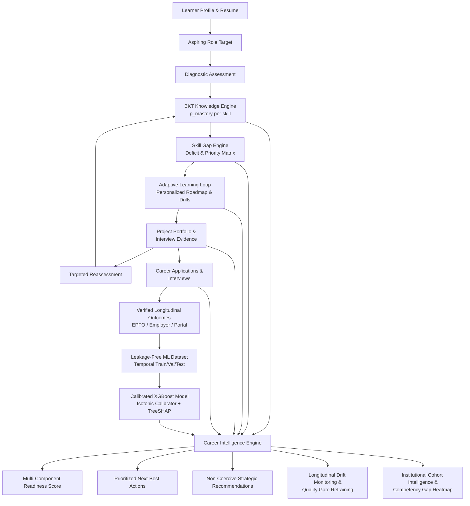
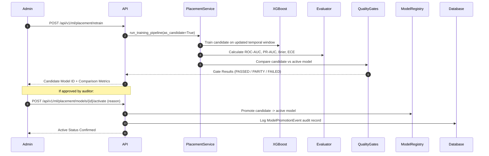

# Phase 6: Production Career Intelligence & Continuous Learning

**KaushalNexus AI Skilling & Career Intelligence Platform**  
*SIH Problem Statement 135 — Longitudinal Tracking & Impact Measurement*

---

## 1. Executive Summary & Closed-Loop Architecture

Phase 6 transforms KaushalNexus into a production-grade, closed-loop career intelligence ecosystem. By uniting Bayesian Knowledge Tracing (BKT), deterministic role matching, adaptive learning, verified longitudinal career outcomes, calibrated XGBoost placement prediction, and decision-support engines, the platform delivers personalized, evidence-grounded career velocity for candidates and actionable cohort intelligence for institutions.



### Architectural Guardrails & Principles
1. **Strict Layer Separation:**
   - **BKT:** Estimates latent skill mastery state $P(L_t) \in [0, 1]$.
   - **Skill Gap Engine:** Computes target role requirement deficits.
   - **Adaptive Learning:** Delivers remedial resources, drills, and spaced repetition.
   - **XGBoost:** Provides a calibrated statistical placement probability estimate based strictly on pre-prediction historical observations.
   - **Career Intelligence Engine:** Synthesizes multi-modal signals into decision support and action prioritization.
2. **Zero Mutation Guarantee:** XGBoost predictions never directly modify BKT mastery states, assessment attempt logs, or verified career outcomes.
3. **Candidate Autonomy:** Placement predictions and alternative role recommendations are advisory decision-support tools. A lower predicted probability never blocks or restricts job applications, course access, or learning pathways.
4. **Transparent Disclaimers:** All interfaces prominently display legal and methodological disclaimers emphasizing that statistical estimates do not guarantee employment offers.

---

## 2. Multi-Component Employment Readiness Model

The platform computes a composite Employment Readiness Index $R \in [0.0, 1.0]$ across six weighted dimensions:

$$R = 0.25 \cdot \text{BKT}_{\text{mean}} + 0.20 \cdot \text{RoleMatch} + 0.15 \cdot (1 - \text{GapDeficit}) + 0.15 \cdot \text{LearningProgress} + 0.15 \cdot \text{ProjectEvidence} + 0.10 \cdot \text{CareerVelocity}$$

### Dimension Breakdown & Weight Justification

| Component | Weight | Source | Metric & Normalization |
|---|---|---|---|
| **BKT Skill Mastery** | 25% | `LearnerSkillMastery` | Mean posterior mastery probability across assessed competencies: $\frac{1}{K}\sum_{k=1}^K P(L_k) \in [0, 1]$. |
| **Role Alignment** | 20% | `RoleMatchingService` | Aspiring role match percentage normalized to $[0, 1]$. |
| **Skill Gap Completeness** | 15% | `SkillGapService` | Inverted average deficit across required skills: $\max(0, 1 - \bar{G}) \in [0, 1]$. |
| **Learning Progression** | 15% | `LearningProgressService` | Completed learning plan modules vs target curriculum $\in [0, 1]$. |
| **Project & Portfolio Evidence** | 15% | `LearnerProject` | Verified projects (0.70 + 0.15/project) or code repository evidence (0.40 - 0.70) $\in [0, 1]$. |
| **Career Velocity** | 10% | `CareerApplication` | Pipeline application volume and active interview stages (0.20 - 0.90) $\in [0, 1]$. |

### Readiness Tiers

```
  [0.00 - 0.39]  ──► NOT_READY          (Focus heavily on core skill acquisition and foundational BKT assessments)
  [0.40 - 0.59]  ──► DEVELOPING         (Address critical skill gaps, complete assigned practice drills)
  [0.60 - 0.79]  ──► CAREER_READY       (Build verified project artifacts, polish resume, commence targeted applications)
  [0.80 - 1.00]  ──► STRONG_READINESS   (Active interview prep, senior mock interviews, high-velocity submissions)
```

---

## 3. Next-Best Action Prioritization Engine

The `CareerActionService` evaluates the learner's state against deterministic rules to produce an evidence-grounded, ranked list of high-impact actions.

### Action Taxonomy

```
                   ┌─────────────────────────────────────────────────────────────┐
                   │                     Next-Best Action Types                  │
                   └──────────────────────────────┬──────────────────────────────┘
                                                  │
          ┌───────────────────────────────────────┴───────────────────────────────────────┐
          ▼                                                                               ▼
   Learning Actions                                                              Application Actions
   ├── PREPARE_INTERVIEW (Interview stage active)                                ├── APPLY_TO_ROLE (High readiness, low apps)
   ├── PRACTICE_DRILL (Developing mastery, drills available)                     ├── CONTINUE_APPLICATIONS (Ready, active pipeline)
   ├── REASSESS (Stale assessment / completed drills)                            └── UPDATE_RESUME (Low ATS alignment / match)
   ├── COMPLETE_PROJECT (No verified project evidence)
   ├── IMPROVE_PROJECT (Unverified repo / missing live demo)
   └── IMPROVE_ROLE_ALIGNMENT (Critical gaps in target role)
```

### Action Priority Calculation
Each action is assigned a priority score $P \in [0.0, 1.0]$ based on current stage constraints:
1. **Active Interviews:** Priority = 0.95 (`PREPARE_INTERVIEW`).
2. **Missing Portfolio:** Priority = 0.88 (`COMPLETE_PROJECT`).
3. **Critical Skill Deficits:** Priority = 0.85 (`PRACTICE_DRILL` or `IMPROVE_ROLE_ALIGNMENT`).
4. **Readiness $\ge 0.65$ with Low Applications:** Priority = 0.82 (`APPLY_TO_ROLE`).
5. **Drill Completion Pending Reassessment:** Priority = 0.78 (`REASSESS`).
6. **Active Application Pipeline:** Priority = 0.72 (`CONTINUE_APPLICATIONS`).

Every action payload returns:
- `action_type`: Standardized enum token
- `title` & `description`: Actionable guidance
- `priority_score`: Rank order weight
- `urgency`: `HIGH`, `MEDIUM`, or `LOW`
- `category`: `LEARNING` or `APPLICATION`
- `reasoning`: Rationale tied directly to candidate evidence
- `evidence`: Detailed context (e.g., specific skill gaps, missing project links, or application counts)

---

## 4. Non-Coercive Strategic Career Recommendations

The `CareerRecommendationService` generates candidate-centric strategic advisory insights:

### Strengths & Risk Identification
- **Verified Strengths:** High BKT mastery ($P(L) \ge 0.75$), verified projects with institutional sign-off, consistent learning progress, and active interview conversions.
- **Risk Factors:** Critical prerequisite skill gaps ($Gap > 0.40$), low portfolio verification status, application inertia (career-ready but 0 applications), and stale assessment states ($> 30$ days without reassessment).

### Non-Coercive Alternative Role Discovery
When a candidate targets a role with severe skill deficits, the engine scans the role catalog to identify adjacent opportunities where the candidate's existing verified skills offer a higher immediate alignment ($\ge 65\%$).

> **Advisory Disclaimer:** Alternative role suggestions are non-coercive and advisory. Candidates always retain full autonomy to pursue their preferred target role. The system never forcibly reassigns a candidate's aspiring role.

---

## 5. Model Governance, Calibration & Longitudinal Drift Monitoring

The `ModelMonitoringService` monitors production models against drift and degradation without requiring heavyweight distributed frameworks.

### Analytical Gaussian Population Stability Index (PSI)
To evaluate distribution shift between baseline training features and live inference requests:

$$PSI = 0.5 \cdot \left[ \frac{(\mu_t - \mu_0)^2}{\sigma_0^2} + \frac{\sigma_t^2}{\sigma_0^2} - 1 - \ln\left(\frac{\sigma_t^2}{\sigma_0^2}\right) \right]$$

- **$PSI < 0.10$:** Normal stability.
- **$0.10 \le PSI < 0.25$:** Moderate drift — advisory warning flagged.
- **$PSI \ge 0.25$:** Critical drift — automated retraining recommendation issued.

### Decile Calibration Tracking
Live predictions are partitioned into 10 deciles ($[0.0 - 0.1), \dots, [0.9 - 1.0]$). As ground-truth verified outcomes arrive from EPFO or employer portals, empirical positive rates are compared against mean predicted probabilities to track Expected Calibration Error (ECE) drift over time.

---

## 6. Shadow Candidate Retraining & Quality Gates

Retraining occurs in shadow mode (`as_candidate=True`), writing artifacts to `models_registry/versions/{candidate_id}/` without disturbing the active production model.



### Strict 4-Gate Quality Protocol

| Gate Name | Metric | Passing Threshold | Rationale |
|---|---|---|---|
| **Discrimination Gate** | ROC-AUC | $\ge \text{Active ROC-AUC} - 0.02$ | Preserves ranking discrimination between placed and non-placed candidates. |
| **Precision-Recall Gate** | PR-AUC | $\ge \text{Active PR-AUC} - 0.02$ | Protects positive class sensitivity under imbalanced placement labels. |
| **Reliability Gate** | Brier Score | $\le \text{Active Brier} + 0.02$ | Penalizes uncalibrated overconfident probability outputs. |
| **Calibration Gate** | ECE | $\le 0.12$ | Guarantees predicted probabilities reflect empirical real-world success frequencies. |

---

## 7. Institutional Cohort Intelligence & Competency Gap Heatmaps

Institutional administrators access macro-level skilling intelligence via `GET /api/v1/ml/career-intelligence/cohort`:

```
┌──────────────────────────────────────────────────────────────────────────────┐
│                    Institutional Skilling Health Dashboard                   │
├─────────────────────┬─────────────────────┬──────────────────┬───────────────┤
│ Total Learners: 48  │ Avg BKT Mastery: 62%│ Verified Placed: │ Avg Placement │
│ Active Learners: 36 │ Learning Comp: 54%  │ 31.2% (15/48)    │ Prob: 64.8%   │
└─────────────────────┴─────────────────────┴──────────────────┴───────────────┘

┌──────────────────────────────────────────────────────────────────────────────┐
│                       Competency Gap Heatmap Matrix                          │
├───────────────────────┬────────────┬─────────────┬───────────┬───────────────┤
│ Competency            │ Target Rol │ Avg Gap     │ Affected  │ Severity      │
├───────────────────────┼────────────┼─────────────┼───────────┼───────────────┤
│ PostgreSQL & Indexing │ Full Stack │ 0.48 (48%)  │ 22        │ CRITICAL      │
│ Docker & Container    │ DevOps     │ 0.42 (42%)  │ 18        │ CRITICAL      │
│ Async Programming     │ Python Dev │ 0.31 (31%)  │ 14        │ MODERATE      │
│ TypeScript Basics     │ Frontend   │ 0.18 (18%)  │ 8         │ LOW           │
└───────────────────────┴────────────┴─────────────┴───────────┴───────────────┘
```

### Automated Institutional Interventions
When aggregate gaps exceed 35% across $> 10$ candidates, the engine prioritizes institutional intervention packages:
- **Curriculum Adaptation:** Inject specific drill modules into cohort default learning plans.
- **Faculty Masterclasses:** Flag high-frequency misconceptions identified during BKT reassessments.
- **Employer Project Sprints:** Match employers willing to mentor students on specific deficient competency clusters.

---

## 8. API Reference Specification

| Endpoint | Method | Role | Description |
|---|---|---|---|
| `/api/v1/learners/me/career-intelligence` | `GET` | `LEARNER` | Self-service endpoint returning readiness score, BKT mastery, XGBoost probability, Next-Best Actions, strengths, risks, and advisory notices. |
| `/api/v1/learners/{learner_id}/career-intelligence` | `POST` | `STAFF` / `ADMIN` | Administrative on-demand evaluation of candidate readiness, next actions, and persistence of snapshot to `placement_predictions`. |
| `/api/v1/ml/placement/monitoring` | `GET` | `STAFF` / `ADMIN` | Returns live model health, PSI feature drift metrics, decile calibration table, and historical monitoring snapshots. |
| `/api/v1/ml/placement/retrain` | `POST` | `ADMIN` | Triggers shadow candidate model training and evaluates against the 4 quality gates. |
| `/api/v1/ml/placement/models/{model_id}/activate` | `POST` | `ADMIN` | Auditable promotion of approved candidate model to production with mandatory justification logging. |
| `/api/v1/ml/career-intelligence/cohort` | `GET` | `STAFF` / `ADMIN` | Macro-level institutional dashboard containing cohort stats, competency gap heatmap, and prioritized institutional interventions. |

---

## 9. Verification & Regression Test Suite

All 8 automated Phase 6 integration and unit tests are passing with full database transaction rollbacks:

```bash
backend/.venv/bin/pytest tests/test_phase6_career_intelligence.py tests/test_phase6_recommendations.py tests/test_phase6_monitoring.py tests/test_phase6_cohort.py -v
```

```
============================= test session starts ==============================
collected 8 items

tests/test_phase6_career_intelligence.py::test_calculate_readiness_score_formula_and_weights PASSED [ 12%]
tests/test_phase6_career_intelligence.py::test_learner_career_intelligence_pipeline_and_audit PASSED [ 25%]
tests/test_phase6_recommendations.py::test_career_action_prioritization_logic PASSED [ 37%]
tests/test_phase6_recommendations.py::test_career_recommendations_and_non_coercive_alternative_role PASSED [ 50%]
tests/test_phase6_recommendations.py::test_strengths_and_risks_extraction PASSED [ 62%]
tests/test_phase6_monitoring.py::test_compute_gaussian_psi_metric PASSED [ 75%]
tests/test_phase6_monitoring.py::test_model_monitoring_and_governance_pipeline PASSED [ 87%]
tests/test_phase6_cohort.py::test_cohort_intelligence_and_heatmap_endpoint PASSED [100%]

========================= 8 passed, 1 warning in 3.16s =========================
```

Furthermore, the frontend production bundle builds cleanly (`2,707 modules transformed`, 0 errors):

```bash
frontend/ npm run build
✓ built in 406ms
```
