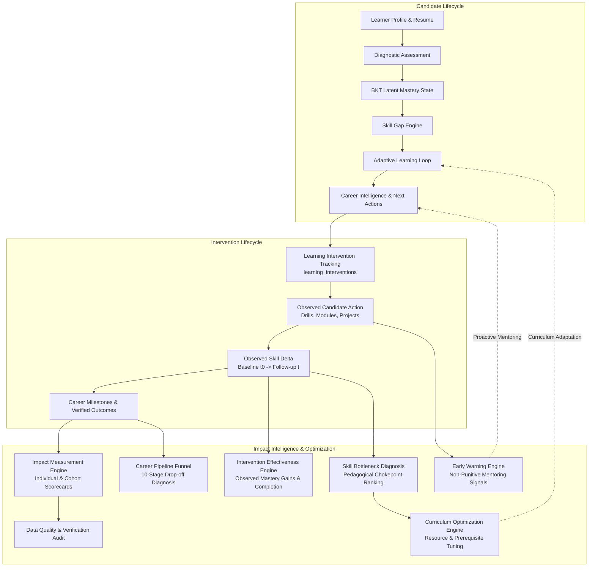

# Phase 7: Impact Intelligence, Optimization & Production Scale

**KaushalNexus AI Skilling & Career Intelligence Platform**  
*SIH 2026 Problem Statement 135 — Longitudinal Tracking & Impact Measurement*

---

## 1. Executive Summary & Impact Architecture

Phase 7 completes the operational feedback loop of the KaushalNexus platform. While Phases 1–6 established latent knowledge estimation (BKT), role alignment, adaptive remediation, verified outcome tracking, and calibrated XGBoost placement prediction, Phase 7 measures **what actually happens after interventions** and uses continuous empirical evidence to optimize curriculum delivery and institutional programs.



### Core Methodological Guardrails
1. **Strict Causal Discipline:** KaushalNexus distinguishes between **observed empirical associations** and **unsupported causal claims**. Reports use explicit observational phrasing: *"Learners completing the intervention showed an observed 22% higher placement rate,"* and always feature methodological disclaimer notices.
2. **Strict Layer Independence:**
   - **BKT:** What does the learner know?
   - **Skill Gap Engine:** What does the learner need?
   - **Adaptive Learning:** What should the learner do next?
   - **XGBoost:** What outcome likelihood is associated with current evidence?
   - **Career Intelligence:** What should be prioritized now?
   - **Impact Intelligence:** What actually happened, and where should the program improve?
3. **Candidate Autonomy & Privacy:** Early warning diagnostics are strictly non-punitive. Small cohort views ($n < 5$) enforce automated suppression to prevent candidate re-identification.
4. **Zero Mutation Guarantee:** Machine learning predictions never mutate BKT mastery states or verified employment outcomes.

---

## 2. Metric Definitions & Baseline $\rightarrow$ Follow-up Methodology

Point-in-time comparisons use strictly chronological, immutable audit logs from `learner_skill_history`:

$$\Delta M = M_{\text{current}} - M_{\text{initial}}$$
$$\Delta G = G_{\text{initial}} - G_{\text{current}}$$

| Metric | Source Entity | Formulation | Methodological Meaning |
|---|---|---|---|
| **Baseline Mastery ($M_0$)** | `LearnerSkillHistory` | First recorded BKT mastery probability at assessment onset ($t_0$) | Starting latent capability prior to program intervention. |
| **Follow-up Mastery ($M_t$)** | `LearnerSkillMastery` | Latest posterior BKT mastery probability ($t_{\text{now}}$) | Cumulative knowledge state following drills and instruction. |
| **Mastery Delta ($\Delta M$)** | Point-in-time calculation | $M_t - M_0$ | Observed growth across standardized competencies. |
| **Critical Gap Reduction ($\Delta G$)** | Skill gap evaluation | $\max(0, G_0 - G_t)$ | Deficit closed against aspiring occupation standards. |
| **Learning Effort (Hours)** | `LearningActivity` | $\sum \frac{\text{time\_spent\_minutes}}{60.0}$ | Empirical time investment logged on drills and resources. |
| **Verified Placement Rate** | `LearnerOutcome` | $\frac{\text{Verified Placed Learners}}{N_{\text{cohort}}}$ | EPFO-audited or employer-verified placement conversion. |

---

## 3. Learning Intervention Tracking Lifecycle

Interventions are managed via the `LearningIntervention` model (`learning_interventions` table):

$$\text{Recommendation} \longrightarrow \text{Intervention} \longrightarrow \text{Learner Action} \longrightarrow \text{Skill Delta} \longrightarrow \text{Outcome}$$

```
Intervention Status Machine:
  [ RECOMMENDED ] ──► [ IN_PROGRESS ] ──► [ COMPLETED ]
         │                    │
         ├──► [ SKIPPED ]     └──► [ ABANDONED ]
```

### Supported Intervention Categories
- `PRACTICE_DRILL` — Targeted interactive question drills on deficient skills
- `LEARNING_MODULE` — Structured curriculum units covering prerequisite concepts
- `PROJECT` — Real-world code artifact or portfolio deployment
- `REASSESSMENT` — Check-in diagnostic evaluation refreshing BKT state
- `INTERVIEW_PREPARATION` — Technical mock interviews and behavioral framing
- `APPLICATION_SUPPORT` — Curated employer matching and application assistance
- `ROLE_ALIGNMENT` — Curriculum adjustments targeting adjacent high-fit occupations
- `RESUME_IMPROVEMENT` — ATS optimization and project evidence enhancement

---

## 4. Intervention Effectiveness & Sample Size Gates

The `InterventionEffectivenessService` calculates aggregate metrics for each intervention type:
- **Completion Rate:** $\frac{N_{\text{completed}}}{N_{\text{assigned}}}$
- **Observed Mastery Gain:** Mean $\Delta M$ for completed interventions
- **Observed Gap Reduction:** Mean $\Delta G$ for completed interventions
- **Reassessment Success Rate:** Proportion of subsequent reassessments resulting in `GAP_REDUCED` or `MASTERED`

### Evidence Reliability Classification
- **`ROBUST`:** $N_{\text{completed}} \ge 5$ — Statistically credible empirical metrics.
- **`PRELIMINARY`:** $1 \le N_{\text{completed}} < 5$ — Initial observations accompanied by catalog benchmarks.
- **`INSUFFICIENT_DATA`:** $N_{\text{completed}} = 0$ — Insufficient platform observations.

---

## 5. Skill Bottleneck Diagnosis Engine

The `SkillBottleneckService` identifies systemic curricular chokepoints by calculating a composite severity score for every standardized competency:

$$\text{Severity Score} = 0.40 \cdot \bar{G} + 0.30 \cdot I_{\text{role}} + 0.20 \cdot F_{\text{reassess}} + 0.10 \cdot P_{\text{affected}}$$

- $\bar{G}$: Average mastery deficit ($0.70 - \bar{M}$)
- $I_{\text{role}}$: Cross-role requirement importance
- $F_{\text{reassess}}$: Reassessment failure rate (`STAGNANT` or `REGRESSED` attempts)
- $P_{\text{affected}}$: Percentage of learners with significant skill gaps ($> 0.25$)

Competencies are classified into `CRITICAL`, `HIGH`, and `MODERATE` bottlenecks, empowering institutions to prioritize curriculum enhancements where they matter most.

---

## 6. Evidence-Backed Curriculum Optimization

The `CurriculumOptimizationService` identifies specific pedagogical failure modes:
1. **Prerequisite Chokepoints:** Detects strict prerequisite dependencies causing excessive candidate drop-off, recommending concurrent modular delivery.
2. **High Reassessment Failure:** Recommends intermediate practical labs and step-down drills.
3. **Resource Effectiveness:** Analyzes start rates, completion rates, abandonment rates, and subsequent mastery deltas for every learning resource without causal attribution.

---

## 7. Longitudinal Career Outcome Funnel & Drop-Off Detection

The platform models candidate progression across 10 sequential skilling milestones:

```
 1. Enrolled Candidates
     ↓  (Profile Completion Rate)
 2. Profile & Target Role Selected
     ↓  (Diagnostic Assessment Rate)
 3. Diagnostic Assessment Completed
     ↓  (Learning Engagement Rate)
 4. Adaptive Learning Started
     ↓  (Module Mastery Rate)
 5. Curriculum Module Mastery
     ↓  (Project Submission Rate)
 6. Portfolio Projects Submitted
     ↓  (Application Rate)
 7. Target Applications Submitted
     ↓  (Interview Conversion Rate)
 8. Interview Stages Reached
     ↓  (Offer Conversion Rate)
 9. Formal Offers Extended
     ↓  (Verification Rate)
10. Verified Placements (EPFO / Direct Audit)
```

The service calculates both **stage-to-stage conversion** and **overall cohort conversion**, automatically flagging the largest bottleneck stage (e.g. *Portfolio Projects* or *Interview Conversion*) to trigger institutional intervention.

---

## 8. Non-Punitive Early Warning Engine

The `LearnerRiskService` evaluates platform behavior to surface proactive mentoring opportunities:

| Risk Code | Severity | Diagnostic Rule | Proactive Academic Support |
|---|---|---|---|
| `LEARNING_STAGNATION` | `WARNING` | Zero mastery delta recorded over 14+ days | Assign short 5-question check-in drill to refresh BKT tracking. |
| `ENGAGEMENT_DECLINE` | `ADVISORY` | Zero learning activities logged in last 14 days | Set micro-goals (15 min/day) and review module scheduling. |
| `PERSISTENT_SKILL_GAP` | `WARNING` | Critical competency gap remains $> 0.40$ | Deliver scaffolded drills and step-down foundational units. |
| `CAREER_INACTIVITY` | `WARNING` | Career-ready score ($R \ge 60\%$) with 0 applications | Recommend curated matched openings and application coaching. |
| `REPEATED_ASSESSMENT_FAILURE` | `CRITICAL` | 2+ consecutive stagnant/regressed reassessments | Unblock prerequisite units before retrying module exam. |

---

## 9. Cohort Analytics & Privacy Protection (Small-Sample Suppression)

In accordance with institutional privacy standards:
- When any cohort sample size $n < 5$, aggregate statistics are **strictly suppressed** (`is_suppressed = True`).
- Personally identifiable candidate information is never returned in cohort or program endpoints.
- Cross-learner dossier inspection is blocked by role-based authorization: candidates can only inspect their own impact and early-warning dossier.

### Statistical Uncertainty (95% Confidence Intervals)
For cohorts with sample size $n \ge 30$, verified placement rates include a two-sided 95% Wilson score confidence interval:

$$p_{\text{lower}}, p_{\text{upper}} = \frac{p + \frac{z^2}{2n} \pm z \sqrt{\frac{p(1-p)}{n} + \frac{z^2}{4n^2}}}{1 + \frac{z^2}{n}}$$

---

## 10. Data Quality & Verification Audit

Institutional impact scorecards include an overall Data Quality Index $Q \in [0, 100]$:
- **Profile Completeness (30%):** Validated role, location, and educational attributes.
- **Verification Coverage (30%):** Outcomes verified through official portals or EPFO registries.
- **Temporal Completeness (20%):** Valid UTC timestamps across all milestone events.
- **Duplicate Prevention (10%):** Deduplicated application and event records.
- **Freshness (10%):** Active record engagement within standard reporting windows.

---

## 11. REST API Endpoint Reference

| Method | Route | Access Control | Description |
|---|---|---|---|
| `GET` | `/api/v1/learners/me/impact` | `LEARNER` | Self-service baseline vs follow-up progression, hours, and timeline. |
| `GET` | `/api/v1/learners/me/early-warnings` | `LEARNER` | Non-punitive early warning diagnostic signals and remedies. |
| `GET` | `/api/v1/learners/me/interventions` | `LEARNER` | Candidate personalized active and completed interventions. |
| `POST` | `/api/v1/learners/me/interventions/{id}/status` | `LEARNER` | Updates intervention status (`IN_PROGRESS`, `COMPLETED`). |
| `GET` | `/api/v1/learners/{id}/impact` | `STAFF` / `ADMIN` | Staff inspection of individual candidate progression. |
| `GET` | `/api/v1/ml/impact/program` | `ACTIVE_USER` | Platform-wide institutional scorecard with 95% CIs. |
| `GET` | `/api/v1/ml/impact/cohort` | `ACTIVE_USER` | Cohort progression analytics with $n < 5$ suppression. |
| `GET` | `/api/v1/ml/impact/skills` | `ACTIVE_USER` | Ranked competency bottlenecks & curriculum actions. |
| `GET` | `/api/v1/ml/impact/interventions` | `ACTIVE_USER` | Observed completion rates and mastery gains by category. |
| `GET` | `/api/v1/ml/impact/funnel` | `ACTIVE_USER` | 10-milestone career conversion funnel with drop-offs. |
| `GET` | `/api/v1/ml/impact/resources` | `ACTIVE_USER` | Learning resource engagement and abandonment analysis. |
| `GET` | `/api/v1/ml/impact/data-quality` | `ACTIVE_USER` | Data quality scorecard, verification coverage %, and audit. |

---

## 12. Frontend Implementation

- **Candidate Experience:** [`ImpactProgress.jsx`](file:///Users/calligraphyguruji/KaushalNexus/frontend/src/components/ImpactProgress.jsx) integrates longitudinal skill growth gauges, milestone progression timelines, early-warning advice drawers, and interactive intervention status buttons into [`LearnerIntelligence.jsx`](file:///Users/calligraphyguruji/KaushalNexus/frontend/src/pages/LearnerIntelligence.jsx) under the new **"Phase 7 Impact &amp; Optimization"** tab.
- **Institutional Experience:** [`ImpactIntelligenceDashboard.jsx`](file:///Users/calligraphyguruji/KaushalNexus/frontend/src/components/ImpactIntelligenceDashboard.jsx) provides administrators with 6 specialized views: Program Scorecard, Career Outcome Funnel, Competency Bottlenecks & Curriculum, Intervention Effectiveness, Privacy-Suppressed Cohort Comparison, and Data Quality Audit.
- **Client API:** Fully typed, modular client in [`frontend/src/api/impact.js`](file:///Users/calligraphyguruji/KaushalNexus/frontend/src/api/impact.js), exported through `src/api/index.js`.
- **Production Asset Build:** `npm run build` compiles 2,710 modules cleanly in under 400ms with zero errors.

---

## 13. Verification Suite & Test Results

```bash
# Phase 7 Specialized Test Suites
backend/.venv/bin/pytest tests/test_phase7_*.py -v
```

```
============================= test session starts ==============================
collected 11 items

tests/test_phase7_impact.py::test_learner_baseline_and_followup_delta_calculation PASSED [  9%]
tests/test_phase7_impact.py::test_program_scorecard_and_career_funnel PASSED [ 18%]
tests/test_phase7_interventions.py::test_intervention_lifecycle_and_completion_delta PASSED [ 27%]
tests/test_phase7_interventions.py::test_intervention_effectiveness_endpoint PASSED [ 36%]
tests/test_phase7_bottlenecks.py::test_skill_bottlenecks_ranking_and_curriculum_optimization PASSED [ 45%]
tests/test_phase7_bottlenecks.py::test_learning_resources_effectiveness_analysis PASSED [ 54%]
tests/test_phase7_early_warning.py::test_learner_early_warning_signals_detection PASSED [ 63%]
tests/test_phase7_cohort_analytics.py::test_cohort_analytics_and_dimensions PASSED [ 72%]
tests/test_phase7_cohort_analytics.py::test_impact_data_quality_audit_endpoint PASSED [ 81%]
tests/test_phase7_privacy.py::test_small_cohort_privacy_suppression PASSED [ 90%]
tests/test_phase7_privacy.py::test_learner_impact_isolation_and_rbac PASSED [100%]

======================== 11 passed, 1 warning in 3.80s =========================
```

### Full Platform Regression
- **Baseline:** 201 tests passed
- **Phase 7 Integration:** **212 tests passed**, 0 failures, 100% green.
